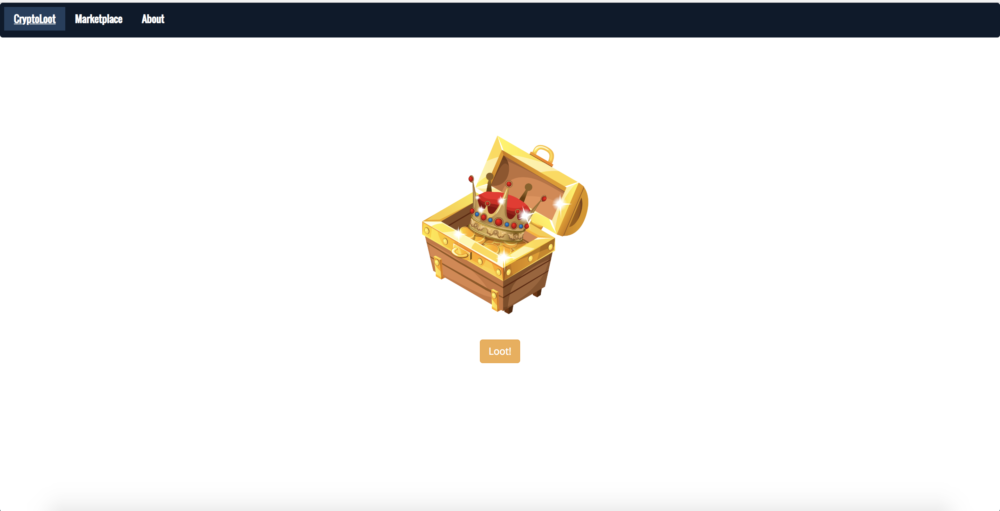

# CryptoLoot
Blockchain + Loot Boxes + Memes = CryptoLoot

CryptoLoot is an exchange built on the Ethereum blockchain that allows for users to collect and have digital ownership of memes by securing their ownership on the Ethereum network.

